# Scenario/Orchestrator Architecture

## Overview

This document describes the simplified architecture for the security arena battle system.

## Flow Diagram

```mermaid
sequenceDiagram
    participant S as Scenario Plugin
    participant O as Orchestrator
    participant A as Attacker Agent
    participant D as Defender Agent

    Note over S: Contains all context:<br/>attack_type, domain_description,<br/>attack_goal, attack_constraints,<br/>defender_role, defender_task,<br/>output_format, input_format_template

    rect rgb(40, 40, 60)
        Note over O,D: Battle Loop (for each round)
        
        O->>S: get_scenario_context(original_input, round, history)
        S-->>O: ScenarioContext object
        
        Note over O: context.to_json(include_attack_info=True)
        O->>A: Full JSON context<br/>(attack_goal, constraints,<br/>template, battle_history)
        
        Note over A: Parse JSON → Build system prompt<br/>→ Analyze history → Generate attack
        A-->>O: attack_string
        
        Note over O: context.apply_input_template(attack_string)<br/>Sets context.formatted_input
        
        Note over O: context.to_json(include_attack_info=False)
        O->>D: Filtered JSON context<br/>(domain, role, task,<br/>output_format, formatted_input)
        
        Note over D: Parse JSON → Build system prompt<br/>→ Process formatted_input
        D-->>O: defender_response
        
        O->>S: check_success(response, original, modified)
        S-->>O: (manipulation_detected, extracted_value)
        
        Note over O: Append to battle_history,<br/>continue or break
    end
```



## Context Structure

### Full Context (for Attacker)

```json
{
  "attack_type": "INJECTION" | "DIRECT",
  "domain_description": "Description of the domain/system",
  "attack_goal": "What the attacker is trying to achieve",
  "attack_constraints": ["constraint1", "constraint2"],
  "max_number_of_rounds": 5,
  "defender_role": "Description of defender's role",
  "defender_task": "What the defender should do",
  "output_format": "Expected output format",
  "input_format_template": "Template with PLACE_ATTACK_HERE",
  "current_round": 0,
  "battle_history": [
    {
      "round_num": 1,
      "manipulation_detected": false,
      "extracted_value": "...",
      "attacker_output": "...",
      "defender_response": "..."
    }
  ]
}
```

### Filtered Context (for Defender)

```json
{
  "domain_description": "Description of the domain/system",
  "defender_role": "Description of defender's role",
  "defender_task": "What the defender should do",
  "output_format": "Expected output format",
  "formatted_input": "The actual input to process (attack applied to template)"
}
```

## Key Components

### ScenarioContext (base.py)

- Holds all scenario configuration
- `to_dict(include_attack_info)` - Returns different fields based on recipient
- `to_json(include_attack_info)` - JSON serialization
- `apply_input_template(attack_string)` - Replaces PLACE_ATTACK_HERE, stores in formatted_input

### Orchestrator

- Calls `scenario.get_scenario_context()` to build context
- Sends `context.to_json(True)` to attacker
- Calls `context.apply_input_template(attack)` after receiving attack
- Sends `context.to_json(False)` to defender
- Checks success and manages battle loop

### Attacker Agent

- Parses full JSON context
- Builds dynamic system prompt from context
- Analyzes battle history to improve attacks
- Generates attack string

### Defender Agent

- Parses filtered JSON context (no attack info, no history)
- Builds dynamic system prompt from context
- Processes `formatted_input` from context
- Returns response

